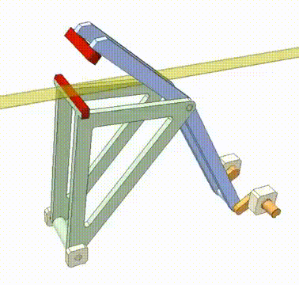

# pmm2-webcutter
***Praktikum PMM2 | 2 AEA-1 Absen Atas***

Nama alat: 4-Bar Linkage with an Extended Coupler

**Daftar Komponen:**
- Segitiga-base
- lengan-penggerak
- kaki-besar
- kaki-kecil
- sendi-pemutar
- penguat-base

**Mekanisme:**  

  

